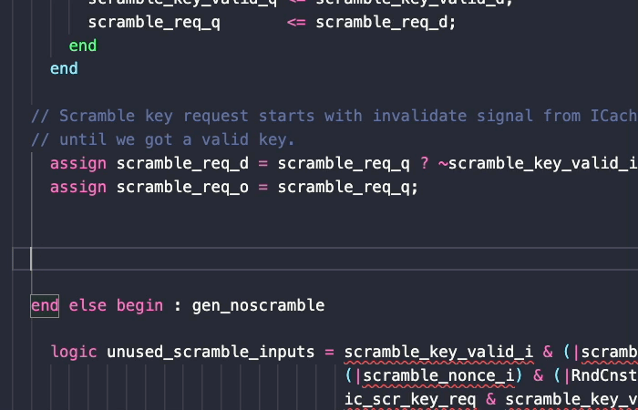
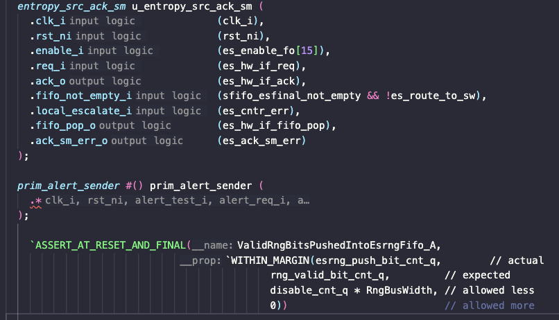

# Slang Server Extended

**Slang Server Extended** is a community fork of
[hudson-trading/slang-server](https://github.com/hudson-trading/slang-server) — a
[Language Server](https://microsoft.github.io/language-server-protocol/) for SystemVerilog built on
the [Slang](https://github.com/MikePopoloski/slang) library — extended to work well with **unusual,
ASIC-style project configurations**: shared work directories, deep flist-driven RTL trees, and
header/fragment files that are only ever `` `include``d rather than compiled standalone.

Everything upstream does, this does too. The additions below are the reason the fork exists; they
are additive and (unless noted) off by default, so nothing from upstream changes behavior unless you
opt in.

## How this fork is built

The changes in this fork are written with a combination of a **locally-run Qwen3 (32B)** model and
**Claude** prompts. It's a personal fork maintained to unblock real ASIC/FPGA workflows. I'm happy
to contribute any of these ideas or changes back to the upstream project if the maintainers are
interested — please open an issue or reach out. Feedback and suggestions are welcome.

## What this fork changes vs. upstream

- **`resolveIncludeFragments`** *(on by default)* — `.vh`/`.svh` files that are only ever
  `` `include``d elsewhere used to be parsed on their own and emit bogus "expected a module" errors,
  with no working goto/hover/references inside them. They are now analyzed in the context of the
  file(s) that include them, so diagnostics are real and position-based features (goto-definition,
  hover, find-references, completions, highlights) work inside headers.
- **`workDir`** — shared work-directory support for ASIC flows. Relative paths in `flags` (e.g.
  `-F ./design.f`) resolve as if the server were launched from `workDir`, exactly like
  `cd <workDir> && <tool> <flags>`.
- **Recursive incdirs for large RTL trees** — documentation and tests covering `-F` (which chdirs
  into the flist's directory) together with slang's native `-I .../` recursive include-dir glob, so
  big multi-folder designs need no per-folder configuration and pick up new subfolders automatically.
- **Bundled Linux binary** — the `linux-x64` VSIX ships the `slang-server` binary directly inside
  the extension, so installing it needs no separate server download or `PATH` setup.
- **CentOS 7 / glibc 2.17 compatible builds** — a fully-static build option
  (`SLANG_SERVER_FULLY_STATIC`) so the bundled binary runs on old-but-common enterprise Linux, not
  just recent glibc. The VSIX packaging step refuses to bundle a non-Release binary.
- **Separate extension identity** — published as **Slang Server Extended** under its own extension
  id and `slangCustom.*` settings namespace, so it can be installed side by side with the original
  extension without the two conflicting over settings.
- **Include-fragment goto/hover/refs fix** — position-based lookups now resolve correctly for every
  token inside an included fragment (previously they silently returned nothing).

Full configuration reference and examples: [FORK_FEATURES.md](FORK_FEATURES.md).

## Install

Install **Slang Server Extended** from the
[VS Code Marketplace](https://marketplace.visualstudio.com/items?itemName=CaioPlazas.slang-server-extended)
(`code --install-extension CaioPlazas.slang-server-extended`), or grab the VSIX from the
[Releases page](https://github.com/CaioPlazas/slang-server-extended/releases). On Linux the server
binary is bundled, so there is nothing else to install. See
[docs/start/installing.md](docs/start/installing.md) for other editors.

## Features

Quick, high quality lint messages on every keystroke, with links to the
[Slang warning reference](https://sv-lang.com/warning-ref.html).

Informative hovers and gotos on nearly every symbol across your workspace and libraries.

Find references across your entire workspace.

Configurable inlay hints that provide useful information.

Intuitive completions for module instances and macros, as well as scope members of packages,
modules, structs, and more.

HDL-specific features that let you easily set a filelist or top level for a design, browse the
elaborated hierarchy, and go back and forth with a waveform viewer.

For more detailed feature info, see [the upstream docs](https://hudson-trading.github.io/slang-server/features/features/).

## Credits & license

A fork of [hudson-trading/slang-server](https://github.com/hudson-trading/slang-server), built on
[Slang](https://github.com/MikePopoloski/slang) by Mike Popoloski. All original work belongs to its
respective authors; this fork retains the upstream MIT license (see [LICENSE](LICENSE)). Thanks to
the Hudson River Trading team and the Slang project for the foundation this builds on.
